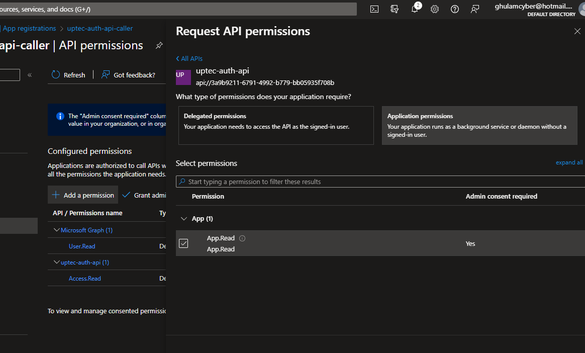

# Auth Series #3 - Call ASP.NET Core API Protected by Azure AD/Microsoft Entra ID via Console Client Credentials Flow


This is 3rd tutorial of the **Auth Series**. Before proceeding to this 
tutorial, make sure you follow the 2nd tutorial here: [Auth Series #2 - Protect ASP.NET Core Api with Azure Entra ID and Access It via Postman](https://github.com/mirzaevolution/Uptec-Protected-Web-Api) 
as we will create new console application to call our previous protected **WeatherForecast** endpoint.

We're going to use Client Credentials Flow (Machine to Machine communication). Thus, no user login involvement in this demo.

**Requirements:**
 
 - Framework: .NET Core 7x Console Project
 - Nuget: Microsoft.Identity.Client


Ok, lets start the first step.

### 1. Create Client Secret


If you follow our previous tutorial, we have created two new app registrations:

 - uptec-auth-api: This app registration used by our protected WeatherForecast api
 - uptec-auth-api-caller: This app registration used by Postman to call the protected api

Now, we need to go to **uptec-auth-api-caller** app registration to generate new client secret for our 
console application. 

> NB: If you don't use the same name, make sure you go to your app registration for calling the api.

Go to the Secret Menu, and generate new one there. Once completed, take a note on the generated secret. 


If you have created the client secret, don't forget to re-capture the client id and tenant id 
of the **uptec-auth-api-caller** for later use in our app.


### 2. Create Application Role for Client Credentials Flow

If you take a look on the previous tutorial for our WeatherForecast api, 
we use scope named: **Access.Read** to be used by Postman. 

Now, because we use Client Credentials Flow, we don't use that name. We use what we call as **App Role**.
It is still the same mechanism like scope but used by applications that don't require user interaction. 
**App Role** is still additional authorization mechanism like scope.


Ok, go to **uptec-auth-api's** app registration, and go to the **App roles** menu.
In that page, Create new app role as shown below.


Once created, go to the **Expose an API** menu and copy the **Application ID URI**. 
This will be used in our console app later with the format of:

> api://3a9b9211-6791-4992-b779-bb05935f708b/.default


### 3. Request API Permission

In the 2nd step, we have created **App Role** for **uptec-auth-api** app registration. 
Now, we need to make sure the caller app/console app can request that properly.
We need to go to **uptec-auth-api-caller** app registration and request that **App Role **permission.

Go to **uptec-auth-api-caller** app registration > API Permission > Add Permission > Search and select in the APIs my organization use.


Once the api selected, choose the Application permissions and tick the App role there.



Last step is to grant that permission. Hit the **Grant admin consent for default directory's** button.


### 4. Create The App

Ok, we need to create a simple .NET Console App. Follow the steps below.


I gave the name as **UptecClientCredentialsConsole**. You can name it anything you want.


Once created, we can install the nuget package for **Microsoft.Identity.Client**.
This library is MSAL (Microsoft Authentication Library) that we use to request token 
so that can be used to access our protected api.


### 5. Implement The Code

In the **Program.cs**, add the following namespaces:

```
using Microsoft.Identity.Client;
using System.Net.Http.Headers;

```


Add the following private members after that. Don't forget to copy paste your Client Id, 
Client Secret, Tenant Id (as part of https://login.microsoftonline.com/TENANT_ID), Scopes info 
(the App Role we previously created) and the Local Web Api Address (WeatherForecast).

```
        #region Private Members
        private static readonly string _authority = "https://login.microsoftonline.com/TENANT_ID";
        private static readonly string _clientId = "CLIENT_ID";
        private static readonly string _clientSecret = "CLIENT_SECRET";
        private static readonly string[] _scopes =
        {
            "api://3a9b9211-6791-4992-b779-bb05935f708b/.default"
        };

        //web api base address
        private static readonly string _apiBaseAddress = "https://localhost:8181";
        private static string _accessToken = "";
        #endregion
```


Now, we need to initialize the **IConfidentialClientApplication**. This instance used to request the token from Azure AD/Microsoft Entra ID.

```
        static async Task InitiateApp()
        {
            IConfidentialClientApplication app =
                ConfidentialClientApplicationBuilder.Create(_clientId)
                .WithClientSecret(_clientSecret)
                .WithAuthority(_authority)
                .Build();
            try
            {
                var result = await app.AcquireTokenForClient(_scopes).ExecuteAsync();
                if (result != null)
                {
                    _accessToken = result.AccessToken;
                    Console.WriteLine(_accessToken);
                }
            }
            catch (Exception ex)
            {
                Console.WriteLine(ex);
            }
        }
```


Create the method to register HttpClient instance with base address of the api and also access token in the Authorization Header.

```
        static HttpClient GetHttpClient()
        {
            var client = new HttpClient
            {
                BaseAddress = new Uri(_apiBaseAddress)
            };
            client.DefaultRequestHeaders.Authorization =
                new AuthenticationHeaderValue("Bearer", _accessToken);
            return client;

        }
```


Last method, we need to create method to invoke the api and print the result to console.

```
        static async Task InvokeApiEndpoint()
        {
            var client = GetHttpClient();
            string path = "/WeatherForecast";
            Console.WriteLine($"\nCalling {path}....");
            string response = await client.GetStringAsync(path);
            Console.WriteLine("Response:");
            Console.WriteLine(response);
        }
```


Then, in the Main method, we need to call the InitializeApp and InvokeApiEndpoint methods.


```
        public static void Main(string[] args)
        {
            InitiateApp().Wait();
            InvokeApiEndpoint().Wait();
        }
```


### 6. Test The Applications.

Make sure you run the previous WeatherForecase web api project in the 2nd tutorial first to 
test our console app.


Now, we can run and test the console app.


Ok, we can see that we have successfully authorized to call the protected api.
Let's check our access token metadata via https://jwt.ms site.


**App Role** that we defined earlier is there as an array of string. 
Actually, this key value data we can use to add additional step as an authorization process 
in the Protected Api part to improve security.


> Sample project: https://github.com/mirzaevolution/Uptec-Call-Protected-Api-Client-Credentials


Regards,

**Mirza Ghulam Rasyid**